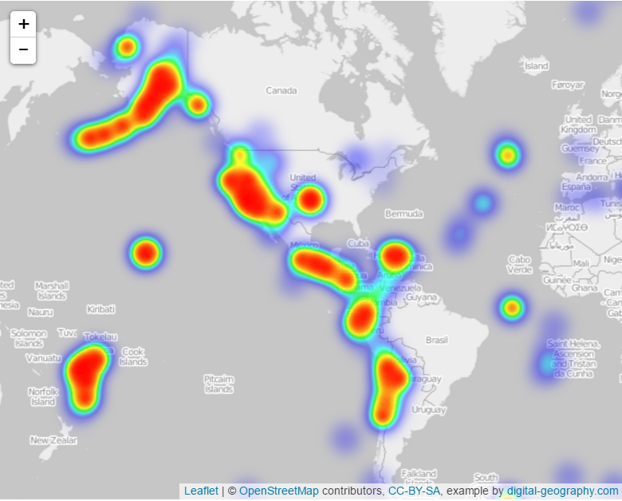

## Geomapping Earhquakes with Leaflet 

I will use the United States Geological Survey (USGS) to visualize earthquake data. I will try to meaningfully display the issues facing our planet.

### Features & Libraries

* Javascript
* HTML
* GeoJSON
* JSON
* Leaflet

### My Process 

1. Get a dataset from data which is updated every 5 minutes

2. Import and visualize the data. 
   -Create a map using Leaflet that plots all of the earthquakes
   -Code markers to reflect the magnitude of earthquakes by size
   -Code markers to reflect depth of earthquake by color
   -Create popups that provide additional information about the earhquake when a marker is clicked
   -Create a legend 

### Visualizations

### Basic Map

### Advanced Map

### Heat Map

### Time Map

